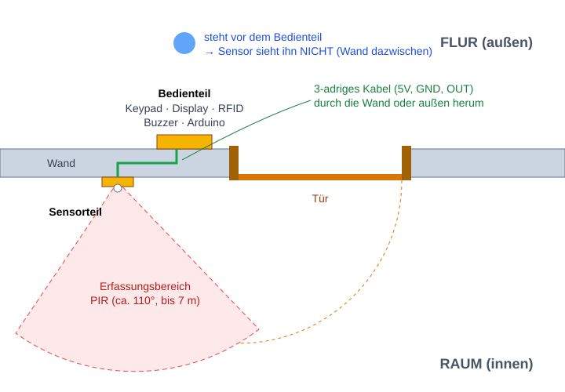
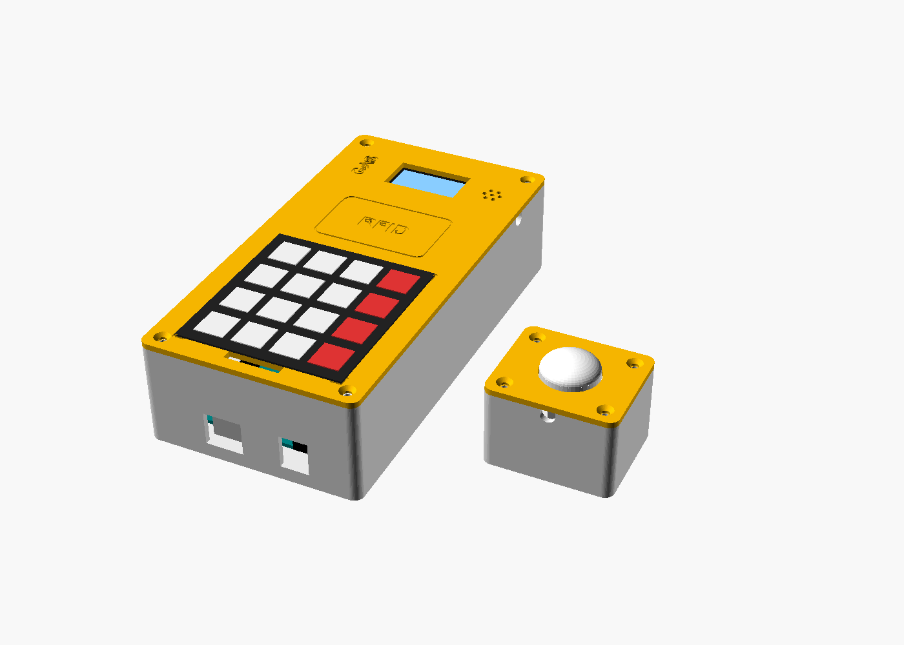
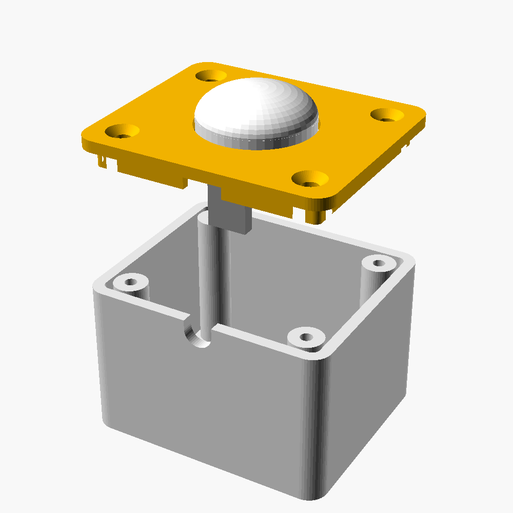
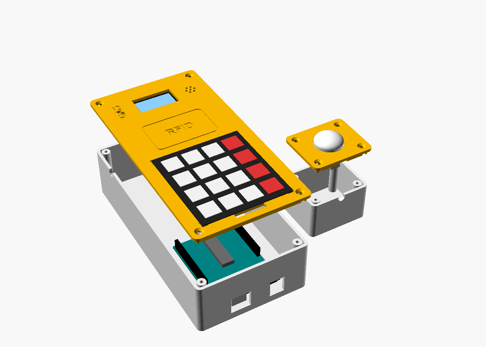
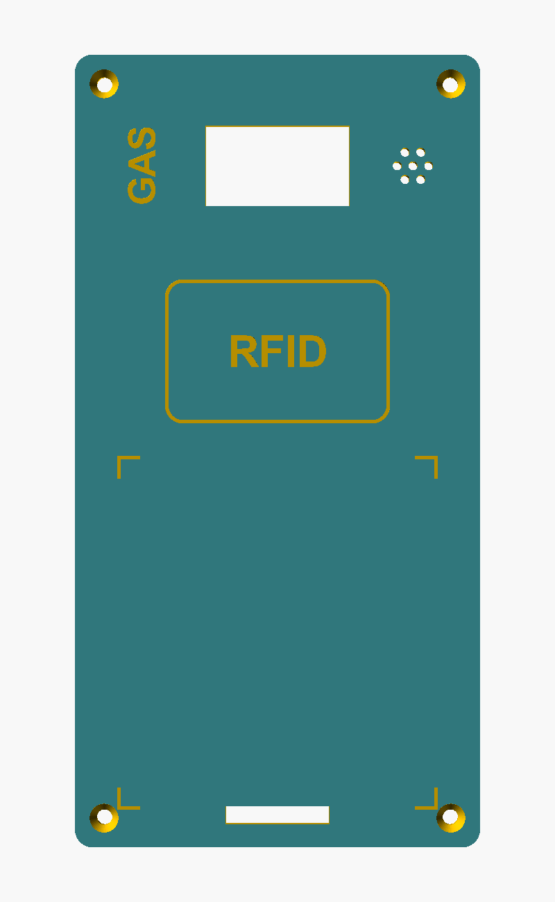
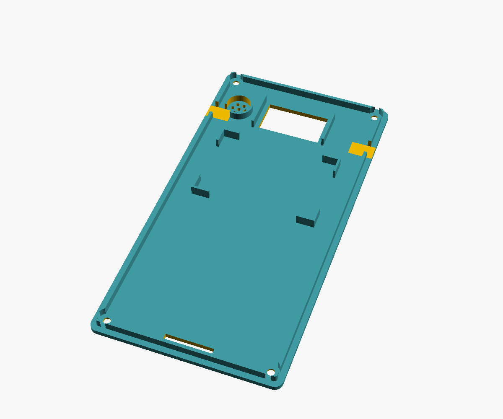
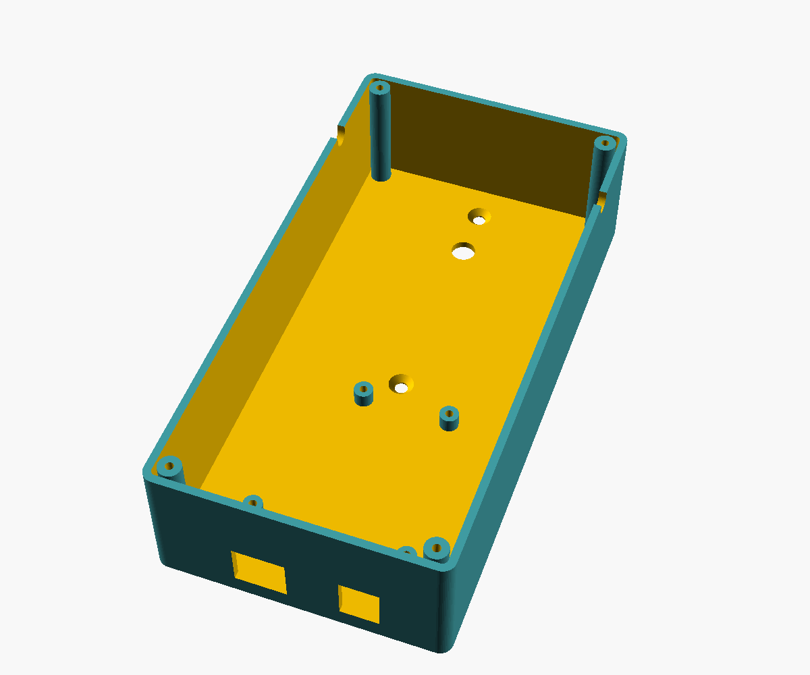

# Gehäuse — Planung und Entwurf

3D-druckbares Gehäuse für das Mini-Sicherheitssystem. Geschrieben für
Einsteiger: Es wird nichts an Vorwissen über 3D-Druck vorausgesetzt.

- Modell (zum Anpassen): [../Gehaeuse/gehaeuse.scad](../Gehaeuse/gehaeuse.scad)
- Fertige Druckdateien: [../Gehaeuse/stl/](../Gehaeuse/stl/)
- Bilder: [../Gehaeuse/bilder/](../Gehaeuse/bilder/)

---

## Teil 1 — Planung

### Anforderungen

1. Keypad, Display, RFID-Leser und Buzzer sitzen **außen** an der Tür bzw.
   neben dem Türrahmen — dort wird ent- und verriegelt.
2. Der Bewegungssensor sitzt **auf der anderen Seite, im Raum**. Er soll erst
   auslösen, wenn jemand den Raum betritt, nicht schon, wenn man zum
   Entsperren vor der Tür steht.
3. Druckbar ohne Erfahrung: keine Stützstrukturen, passt auf kleine Drucker,
   Befestigung mit einfachen Schrauben und Heißkleber.
4. Keine Änderung an Firmware oder Verdrahtung nötig.

### Konzept: zwei Gehäuse, ein Kabel

- **Bedienteil** (außen): Keypad, OLED, RC522, Buzzer und der Arduino Uno.
- **Sensorteil** (innen): nur der HC-SR501.
- Verbunden über ein **3-adriges Kabel** (5V, GND, OUT → A2). Der Bewegungs-
  sensor braucht nur diese drei Leitungen, ein langes Kabel ist für das
  digitale Signal kein Problem.

**Warum das funktioniert:** Ein PIR-Sensor „sieht“ Wärmestrahlung nur in
direkter Sichtlinie. Wände, Türen und sogar normales Glas blockieren sie.
Der Sensor zeigt in den Raum, die Wand steht zwischen ihm und der Person am
Bedienteil — die kann er also gar nicht erfassen. Erst wer die Tür öffnet
und eintritt, läuft in den Erfassungsbereich.

### Bedienteil (außen)

Größe: **90 × 176 × 45 mm** (B × H × T). Zwei Druckteile: Rückteil (Wanne) und
Frontplatte.

| Bereich | Bauteil | Befestigung |
|---|---|---|
| oben | OLED hinter einem Fenster (32 × 18 mm) | seitliche Führungen, nach oben/unten schiebbar bis das Bild mittig sitzt, dann Heißkleber |
| oben rechts | Buzzer hinter 7 Schalllöchern | Ring als Halter + Heißkleber |
| Mitte | RC522 hinter der Frontplatte, Feld „RFID“ eingraviert | vier Eckführungen + Heißkleber. Die Karte liest durch 2,4 mm Kunststoff problemlos |
| unten | Folien-Keypad **außen aufgeklebt** (Klebefolie auf der Rückseite) | Eckmarken zeigen die Position, das Flachkabel geht durch einen Schlitz direkt darunter |
| hinten | Arduino Uno auf 4 Abstandshaltern, USB-/Strombuchse zeigt nach unten | 4 Schrauben |
| hinten, über dem Uno | Platz für ein Mini-Breadboard (5V-/GND-Verteilung) | Klebefolie |

Das RFID-Feld liegt bewusst **nicht** hinter dem Keypad: Die Folientastatur hat
Leiterbahnen aus Metall, die das Funkfeld stören würden.

Öffnungen im Rückteil:

- unten: Aussparungen für **USB-B** und **Hohlstecker** (Stromversorgung)
- Rückwand: **Kabelloch Ø 8 mm** (Kabel direkt durch die Wand zum Sensor)
- links und rechts: je eine **Kabelkerbe** am Rand (Kabel außen auf der Wand
  verlegt — nimm die Seite, die zur Tür zeigt)
- Rückwand: 2 **Löcher für die Wandmontage** (Schraubenkopf versenkt, die
  Rückseite bleibt flach — geht also auch mit Klebestreifen)

### Sensorteil (innen)

Größe: **52 × 44 × 35 mm**. Die Linse (weiße Kuppel) schaut vorne heraus, die
Platine hängt an zwei Zapfen an der Frontplatte. Nach dem Abnehmen der Front
kommt man an die beiden Drehregler (Empfindlichkeit, Haltezeit). Kabel raus
durch Loch in der Rückwand oder Kerbe unten.

### Montageort

- **Bedienteil:** außen neben dem Türrahmen auf der Schlossseite, Oberkante
  etwa auf **1,40 m** — dann ist das Display gut lesbar.
- **Sensorteil:** innen auf **derselben Wand** neben der Tür, etwa
  **1,5–2 m hoch**, Kuppel zeigt in den Raum. Nicht auf Heizkörper, Fenster
  mit direkter Sonne oder Lüftungen richten (Fehlalarme durch Wärme).
- **Kabel** nie durch den Türspalt auf der Schlossseite führen (wird
  eingeklemmt). Entweder ein kleines Loch durch die Wand (Ø 6–8 mm) oder
  mit Kabelclips außen um den Türrahmen herum.
- **Für die Präsentation:** Ein Brett oder eine stabile Pappe spielt die Wand:
  Bedienteil vorne, Sensorteil hinten, Kabel durch ein Loch im Brett.

### Designentscheidungen für den 3D-Druck

- **Jedes Teil liegt mit einer großen, flachen Seite auf dem Druckbett.** Die
  Frontplatte wird mit der Sichtseite nach unten gedruckt → glatte Front,
  Gravuren gelingen sauber. Keine Stützstrukturen nötig.
- Die Frontplatte hat einen umlaufenden **Rand (Lippe)**, der in das Rückteil
  greift — so rutscht nichts und sie sitzt von selbst mittig.
- **Schrauben direkt in den Kunststoff:** Die Löcher haben 2,5 mm, eine 3-mm-
  Schraube schneidet sich ihr Gewinde selbst. Keine Gewindeeinsätze nötig.
- Wandstärke 2,4 mm = 6 Druckbahnen bei der üblichen 0,4-mm-Düse. Stabil,
  aber nicht übertrieben.
- **Positionier-Führungen statt exakter Halter:** Die Maße der Module kommen
  aus Datenblättern, und Klone weichen gern ein paar Zehntel ab. Führungen +
  Heißkleber verzeihen das.
- Größtes Teil 90 × 176 mm → passt auch auf kleine Drucker (180 × 180 mm Bett).

---

## Teil 2 — Entwurf

| Datei | Teil | Druckzeit (ca.) | Material (ca.) |
|---|---|---|---|
| [control_back.stl](../Gehaeuse/stl/control_back.stl) | Bedienteil, Rückteil | 6–8 h | 100 g |
| [control_front.stl](../Gehaeuse/stl/control_front.stl) | Bedienteil, Frontplatte | 2–3 h | 45 g |
| [sensor_back.stl](../Gehaeuse/stl/sensor_back.stl) | Sensorteil, Rückteil | 1,5–2 h | 25 g |
| [sensor_front.stl](../Gehaeuse/stl/sensor_front.stl) | Sensorteil, Frontplatte | 20–30 min | 6 g |

Zusammen rund 180 g PLA, also ca. 4–5 € Material. Die Zeiten hängen stark vom
Drucker ab — der Slicer zeigt den genauen Wert an.

| Frontplatte von vorne | Frontplatte von innen | Rückteil |
|---|---|---|
|  |  |  |

### Schritt 1 — Vor dem Drucken nachmessen

Die Maße stammen aus Datenblättern, nicht vom echten Aufbau. Einmal mit Lineal
oder Messschieber prüfen. Weicht etwas um **mehr als 1 mm** ab, den Wert in der
`.scad`-Datei ändern (siehe Schritt 6):

| Was messen | Variable | Annahme |
|---|---|---|
| Folien-Keypad Breite × Höhe (ohne Flachkabel) | `keypad_w`, `keypad_h` | 69,5 × 77 mm |
| Stecker am Ende des Keypad-Flachkabels (muss durch den Schlitz) | `ribbon_slot_w`, `ribbon_slot_h` | Schlitz 23 × 4 mm |
| RC522-Platine | `rfid_w`, `rfid_h` | 60 × 40 mm |
| OLED-Platine | `oled_w`, `oled_h` | 36 × 34 mm |
| Durchmesser des Buzzers (schwarzer Zylinder) | `buzzer_d` | 12 mm |
| HC-SR501: Linse Ø und Abstand der 2 Befestigungslöcher | `pir_dome_d`, `pir_hole_dist` | 23 mm / 28 mm |

Außerdem kurz nachsehen:

- **OLED:** Zeigen die 4 Pins nach hinten (weg vom Display)? Sonst stoßen sie
  an die Frontplatte.
- **RC522:** Dem Modul liegen meist eine gerade und eine **gewinkelte
  Stiftleiste** bei. Die gewinkelte spart Platz nach hinten. Ist schon eine
  gerade eingelötet, geht es auch so, die Kabel müssen dann etwas gebogen werden.

**Tipp:** Zuerst nur die kleine Sensor-Frontplatte drucken (≈ 30 min) und
prüfen, ob die Linse durchpasst und die Löcher sitzen. So sieht man schnell,
ob der Drucker maßhaltig druckt, bevor die großen Teile dran sind.

### Schritt 2 — Wo drucken?

- Schul-/Ausbildungsbetrieb-Drucker, Makerspace oder FabLab in der Nähe,
  manche Stadtbibliotheken
- Bekannte mit Drucker — die STL-Dateien reichen, mehr braucht niemand
- Online-Druckdienst (STL hochladen, Material PLA wählen)

### Schritt 3 — Slicen (STL → Druckdatei)

Ein Drucker kann STL nicht direkt drucken. Ein **Slicer** zerlegt das Modell in
Schichten und erzeugt die Druckdatei (G-Code). Kostenlos: PrusaSlicer, Bambu
Studio, Orca Slicer oder Cura — je nachdem, welcher Drucker es ist.

1. STL-Datei in den Slicer ziehen.
2. **Nicht drehen** — die Teile liegen schon richtig (große flache Seite unten,
   Frontplatten mit der Sichtseite nach unten).
3. Einstellungen:

| Einstellung | Wert |
|---|---|
| Material | **PLA** (am einfachsten zu drucken) |
| Düse | 0,4 mm (Standard) |
| Schichthöhe | 0,2 mm |
| Wände / Perimeter | 3 |
| Füllung (Infill) | 15–20 % |
| Stützstrukturen (Supports) | **aus** |
| Brim / Rand | aus. Nur beim großen Rückteil einschalten, falls sich die Ecken vom Bett lösen |

4. „Slicen“ klicken, Druckdatei auf den Drucker (USB-Stick, SD-Karte oder WLAN).
5. Die **erste Schicht beobachten**: Sie muss sauber am Bett haften. Bei der
   Frontplatte entstehen in der ersten Schicht die Gravuren („RFID“, „GAS“,
   Eckmarken).

### Schritt 4 — Einkaufsliste

| Anzahl | Teil | Wofür |
|---|---|---|
| 8 | Senkkopf-Schraube 3 × 12 mm (Spanplattenschraube oder M3 × 12) | Frontplatten an beide Gehäuse |
| 4 | Schraube 3 × 8 mm mit flachem Kopf (Linsenkopf) | Arduino Uno |
| 2 | Schraube M2 × 6 mm | HC-SR501 (alternativ Heißkleber) |
| 4 | Senkkopf-Holzschraube 3,5–4 mm + Dübel | Wandmontage (alternativ: Powerstrips / Montageklebeband) |
| 1 | 3-adriges Kabel, Länge je nach Weg (ca. 0,3 m durch die Wand, 1,5–2 m außen herum) + Dupont-Stecker | Verbindung zum Sensor |
| 1 | Mini-Breadboard 170 Kontakte (falls nicht vorhanden) | 5V/GND verteilen |
| 1 | USB-Netzteil 5 V + USB-B-Kabel | Stromversorgung |
| — | Heißklebepistole | Module fixieren |

### Schritt 5 — Zusammenbau

**Bedienteil:**

1. Frontplatte: Keypad-Folie abziehen, Flachkabel mit Stecker durch den
   Schlitz fädeln, Keypad an den vier Eckmarken ausrichten und festdrücken.
2. RC522 in die Eckführungen legen (flache Seite zur Front), mit zwei Punkten
   Heißkleber fixieren.
3. Buzzer in den Ring stecken, Heißkleber.
4. OLED zwischen die Führungen, Glas zur Front. Einschalten, das Bild im
   Fenster mittig schieben, dann erst festkleben.
5. Uno mit 4 Schrauben auf die Abstandshalter im Rückteil schrauben (Buchsen
   zeigen zu den Aussparungen unten).
6. Mini-Breadboard auf die Rückwand über dem Uno kleben (zwischen den beiden
   Montagelöchern).
7. Verkabeln wie bisher (Pin-Tabelle in [../CLAUDE.md](../CLAUDE.md)). Das
   Sensorkabel durch Kabelloch oder Kerbe hereinführen: 5V, GND, A2.
8. **Erst testen**, dann Frontplatte aufsetzen und mit 4 Schrauben festziehen.
   Nicht zu fest — Kunststoffgewinde überdreht leicht.

**Sensorteil:**

1. HC-SR501 mit der Linse durch die Öffnung stecken und mit 2 M2-Schrauben
   an die Zapfen schrauben (oder Heißkleber).
2. Tipp zu den Reglern: Haltezeit-Regler (Time) ganz gegen den Uhrzeigersinn
   = kürzeste Zeit (≈ 3 s), Jumper auf **H** (wiederholtes Auslösen).
3. Kabel anstecken (VCC, OUT, GND), durch das Loch oder die Kerbe führen,
   Frontplatte festschrauben.
4. Nach dem Einschalten braucht der HC-SR501 **etwa eine Minute zum
   Aufwärmen**, in der Zeit meldet er manchmal Bewegung. Bei der Vorführung
   einplanen.

**Montage:** Beide Rückteile zuerst an die Wand (Schraubenköpfe sitzen innen
versenkt), danach Elektronik rein und zuschrauben.

### Schritt 6 — Anpassen in OpenSCAD (nur wenn nötig)

Das Gehäuse ist in **OpenSCAD** gezeichnet — ein kostenloses CAD-Programm, in
dem das Modell als Text beschrieben wird. Deshalb lässt es sich über Zahlen
ändern, ohne zeichnen zu können.

1. OpenSCAD herunterladen: <https://openscad.org/downloads.html>
2. [../Gehaeuse/gehaeuse.scad](../Gehaeuse/gehaeuse.scad) öffnen.
3. Menü **Fenster → Customizer** einblenden. Dort stehen alle Maße als
   Eingabefelder, oben unter „Part selection“ wählt man das Teil.
4. Wert ändern, **F5** = schnelle Vorschau (`assembly` zeigt alles
   zusammengebaut mit den Modulen).
5. Zum Exportieren: ein Teil wählen (z. B. `control_front`), **F6** (Rendern,
   dauert ein paar Sekunden), dann **F7** bzw. *Datei → Export → STL*.

Die Gesamthöhe des Bedienteils berechnet sich automatisch aus Keypad, RFID und
OLED. Wird also z. B. `keypad_h` größer, wächst das Gehäuse mit.

### Offene Punkte / Annahmen

- Alle Modulmaße aus Datenblättern, **nicht am echten Aufbau gemessen**
  (siehe Schritt 1).
- Noch nicht gedruckt — die Passung (0,3 mm Spiel zwischen Front und Rückteil)
  ist ein üblicher Wert, kann aber je nach Drucker etwas zu stramm oder zu
  locker sein. Dann `clr` anpassen.
- Die Uno-Maße (Lochbild, Buchsen) sind die offiziellen Maße des Uno R3 und
  sollten stimmen.
