  

  <a href="https://rexi255.github.io/Arduino-Security-System/"><b>▶ 3D-Modell im Browser öffnen</b></a>
  &nbsp;·&nbsp; <a href="MDs/anleitung.md">Bedienungsanleitung</a>
  &nbsp;·&nbsp; <a href="Schaltplan/SCHALTPLAN.png">Schaltplan</a>
  &nbsp;·&nbsp; <a href="Code/alarm_system/alarm_system.ino">Firmware</a>

Ein kleines Alarmsystem auf einem Arduino Uno R3, gebaut als Schulprojekt im
Lernfeld 7. Scharf und unscharf schaltest du es mit einer PIN am 4x4-Keypad
oder mit einer RFID-Karte. Ist es scharf, löst der Bewegungsmelder eine
30-Sekunden-Sirene aus. Das OLED zeigt nur Symbole: ein Herz, wenn die Anlage
unscharf ist, einen Totenkopf, wenn sie scharf ist, und einen blinkenden
Totenkopf beim Alarm. Karten lernst du direkt am Gerät an, einen PC brauchst du
dafür nicht.

  

## Funktionen

- **Zwei Wege zum Schalten:** PIN + `#` am Keypad oder eine gespeicherte RFID-Karte. Beide machen genau dasselbe.
- **Ausgangszeit:** Nach dem Scharfschalten hast du 10 s, um den Raum zu verlassen. Währenddessen piept der Buzzer jede Sekunde.
- **Alarm:** Er startet bei Bewegung (nur im Zustand SCHARF) oder nach **3 Fehlversuchen** (falsche PIN oder unbekannte Karte). Die Sirene läuft 30 s oder bis zur richtigen PIN bzw. einer bekannten Karte.
- **Rückmeldung:** Ein heller Doppelton bedeutet OK, ein raues Brummen einen Fehler. Die PIN erscheint nur als `*`, eine falsche Eingabe zeigt kurz ein ✖.
- **Admin-Menü am Gerät:** `A` + Admin-PIN + `#` öffnet es. Dort lernst du Karten an (Karte einfach auflegen) oder blätterst die gespeicherten Karten durch und löschst sie. Die Karten liegen im internen EEPROM und bleiben auch nach einem neuen Upload erhalten.
- **RFID-Reset:** `B` startet den RC522 neu, falls ein Klon-Modul hängen bleibt.

## Bedienung in Kürze

| Taste | Wirkung |
|---|---|
| `0`–`9` | PIN eingeben (erscheint als `*`) |
| `#` | Eingabe bestätigen |
| `*` | Eingabe löschen · im Admin-Menü: zurück / verlassen |
| `A` | im Zustand UNSCHARF: Admin-PIN eingeben → Admin-Menü |
| `B` | im Zustand UNSCHARF: RFID-Leser neu initialisieren |
| Karte auflegen | wirkt wie die richtige PIN (wenn gespeichert) |

Die ausführliche Anleitung für Endnutzer liegt in [MDs/anleitung.md](MDs/anleitung.md),
als PDF in [Anleitung/](Anleitung/Mini%20Security%20System%20Manual.pdf).

## Hardware

| Bauteil | Anschluss am Uno | Hinweis |
|---|---|---|
| Arduino Uno R3 | – | ATmega328P, 2 KB SRAM |
| 4x4-Keypad | Reihen R1–R4 → D9–D6, Spalten C1–C4 → D5–D2 | Matrix wird im Sketch selbst gescannt |
| OLED 1,3" 128x64 | SDA → A4, SCL → A5 | Controller **SH1106**, I²C-Adresse `0x3C` |
| RFID-RC522 | SS → A0, RST → A1, MOSI → D11, MISO → D12, SCK → D13 | **VCC an 3,3 V**, 5 V zerstört das Modul |
| Bewegungsmelder (PIR) | OUT → A2 | active HIGH |
| Passiver Buzzer | Signal → D10 | direkt am Pin, ohne Transistor |
| 9V-Block | Hohlstecker | Versorgung |

Alle anderen VCC-Pins hängen an 5 V, alle GND-Pins gemeinsam an GND. Damit ist
der Uno komplett belegt, frei sind nur noch D0/D1 (Serial). Die komplette
Bauteilliste steht in [Teile.xlsx](Teile.xlsx).

  

Der Original-Schaltplan aus Cirkit Designer liegt unter
[Schaltplan/](Schaltplan/SCHALTPLAN.png) (PNG und SVG).

## Inbetriebnahme

1. **Arduino IDE** installieren und im Library Manager diese Libraries holen:
   - **Adafruit SH110X** (die Abhängigkeiten *Adafruit GFX* und *Adafruit BusIO* mitinstallieren)
   - **MFRC522** (GithubCommunity)
   - **Keypad** (Mark Stanley / Alexander Brevig), nur für `hardware_test`
   - `Wire`, `SPI` und `EEPROM` sind in der IDE schon enthalten.
2. PIN und Admin-PIN oben in [alarm_system.ino](Code/alarm_system/alarm_system.ino) anpassen (`PIN_CODE`, `ADMIN_PIN`).
3. Board **Arduino Uno** und den richtigen Port wählen, dann hochladen.
4. Den seriellen Monitor auf **9600 Baud** stellen. Beim Start erscheinen dort die RC522-Version (`0x91`/`0x92` = ok), die Zahl der gespeicherten Karten und der freie SRAM.
5. Beim allerersten Start ist das EEPROM leer. Der Sketch schreibt dann die Werksvorgabe `DEFAULT_UIDS` hinein. Danach verwaltest du die Karten nur noch über das Admin-Menü.

Wenn etwas nicht läuft, prüfen die Test-Sketches jedes Bauteil einzeln:

| Sketch | Zweck |
|---|---|
| [Code/alarm_system/](Code/alarm_system/alarm_system.ino) | **Hauptfirmware**: Zustandsautomat, PIN, RFID, Admin-Menü, Töne |
| [Code/hardware_test/](Code/hardware_test/hardware_test.ino) | Bring-up-Test: OLED, Keypad, Buzzer, Bewegungsmelder |
| [Code/display_test/](Code/display_test/display_test.ino) | nur das OLED (Symbole + freier SRAM) |
| [Code/rfid_test/](Code/rfid_test/rfid_test.ino) | nur der RC522 (Version, UID jeder Karte) |

## 3D-Modell im Browser

**[▶ rexi255.github.io/Arduino-Security-System](https://rexi255.github.io/Arduino-Security-System/)**

Der Aufbau als interaktives 3D-Modell (three.js), angelegt nach dem Schaltplan.
In dem Modell läuft die Firmware-Logik aus `alarm_system.ino` nach, also
dieselben Zustände, Zeiten, Töne und OLED-Grafiken:

- Tasten am 3D-Keypad oder in der Seitenleiste drücken. Die Tastatur geht auch (Enter = `#`, Esc = `*`).
- Karten und den Schlüsselanhänger anklicken: Sie schweben zum RC522, die SPI-Leitungen leuchten auf.
- Den Bewegungsmelder anklicken, um im Zustand SCHARF den Alarm auszulösen.
- Ein Signalpuls wandert über das jeweilige Kabel. Ein Tastendruck lässt genau seine Reihen- und Spaltenleitung aufleuchten, und die L-LED an D13 flackert bei SPI-Verkehr.
- Der Buzzer piept über WebAudio, dazu gibt es einen seriellen Monitor und eine EEPROM-Kartenliste.

Im Modell gelten Demo-PINs (`1234` und Admin `0000`), nicht die echten aus dem
Sketch. Offline öffnest du einfach [docs/viewer/index.html](docs/viewer/index.html)
im Browser.

> **Einmalig einrichten:** Im Repo unter *Settings → Pages → Source* die Option
> „GitHub Actions“ wählen. Danach veröffentlicht
> [.github/workflows/pages.yml](.github/workflows/pages.yml) das Modell bei jedem
> Push nach `main` automatisch.

## Stolperfallen, die wir gelöst haben

- **Das OLED ist ein SH1106, kein SSD1306.** Mit der SSD1306-Library bleibt es leer oder zeigt nur Streifen. Richtig ist `Adafruit_SH1106G`.
- **SRAM ist knapp.** Der OLED-Puffer belegt allein 1024 der 2048 Byte. Mit der Keypad-Library blieben nur ~205 Byte übrig, und das führte zu Resets und falschen Tasten. Deshalb scannt der Sketch die Matrix selbst, und alle Strings stehen mit `F()` im Flash.
- **`SPI.begin()` setzt D10 auf HIGH**, weil D10 der SS-Pin des AVR ist. Genau dort hängt aber der Buzzer. Deshalb setzt der Sketch den Buzzer-Pin erst *nach* `SPI.begin()` auf LOW.
- **Der Bewegungsmelder ist auf A2 umgezogen**, weil D11 fest der SPI-MOSI-Pin ist. A2 funktioniert ganz normal mit `digitalRead()`.
- **RC522-Polling blockiert ~25 ms**, wenn keine Karte aufliegt. Deshalb fragt der Sketch den Leser nur alle 200 ms ab, sonst wird das Keypad träge und die Sirene stockt.

## Projektstruktur

| Ordner/Datei | Inhalt |
|---|---|
| [Code/](Code/) | Arduino-Sketches, je ein Unterordner pro Sketch |
| [docs/](docs/) | animierte README-Grafiken (SVG) und der 3D-Viewer (`docs/viewer/`) |
| [MDs/](MDs/) | Doku: [Hardware-Spezifikation](MDs/aufbau.md), [Bedienungsanleitung](MDs/anleitung.md), [Entwicklungsverlauf](MDs/entwicklungsverlauf.md) |
| [Anleitung/](Anleitung/) | Bedienungsanleitung als PDF |
| [Schaltplan/](Schaltplan/) | Schaltplan (PNG/SVG) |
| [Teile.xlsx](Teile.xlsx) | Bauteilliste |
| [CLAUDE.md](CLAUDE.md) | Projektkontext und Hardware-Fakten für die Entwicklung mit Claude Code |

Die Firmware ist zusammen mit Claude Code entstanden. Alle Prompts und
Antworten sind in [MDs/entwicklungsverlauf.md](MDs/entwicklungsverlauf.md)
protokolliert.

## Lizenz

[MIT](LICENSE). Der 3D-Viewer nutzt [three.js](https://threejs.org/) (MIT, liegt
unter `docs/viewer/three.min.js` bei).
